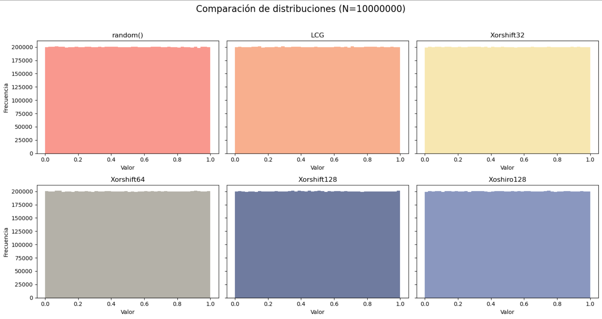
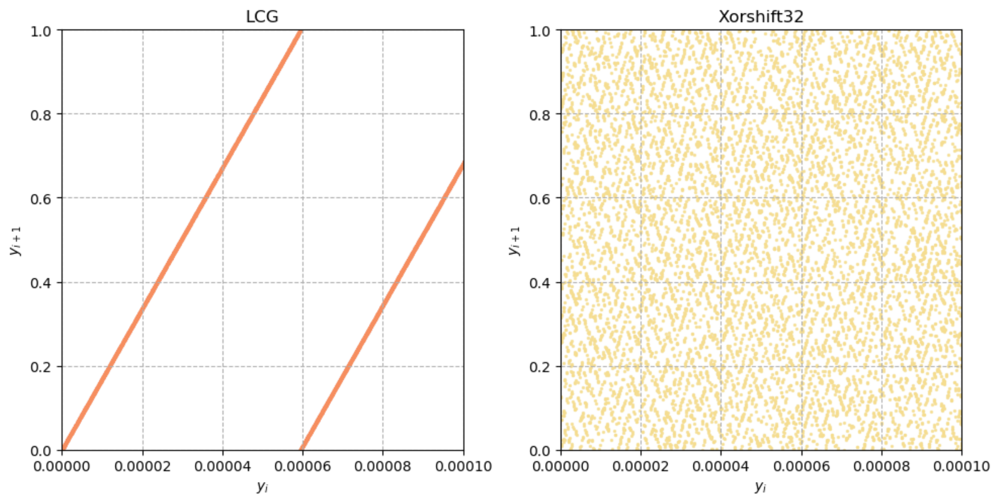
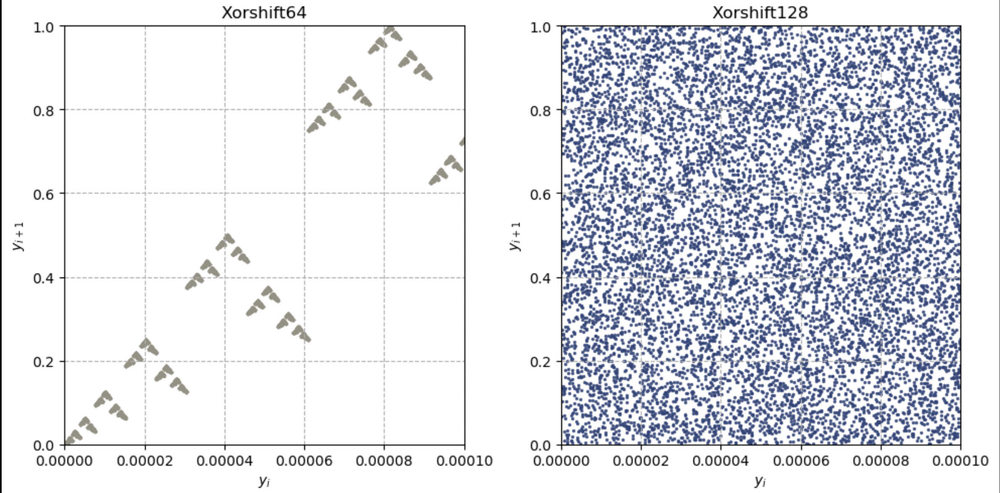
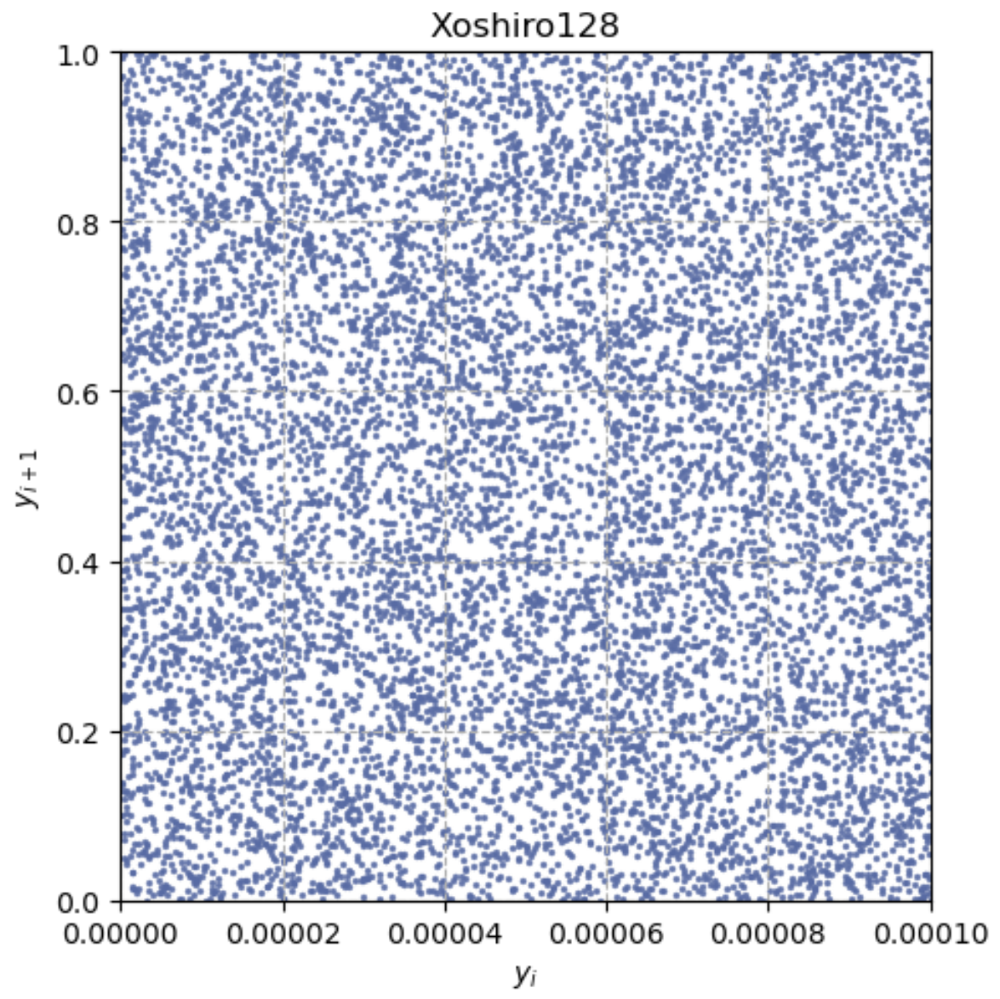
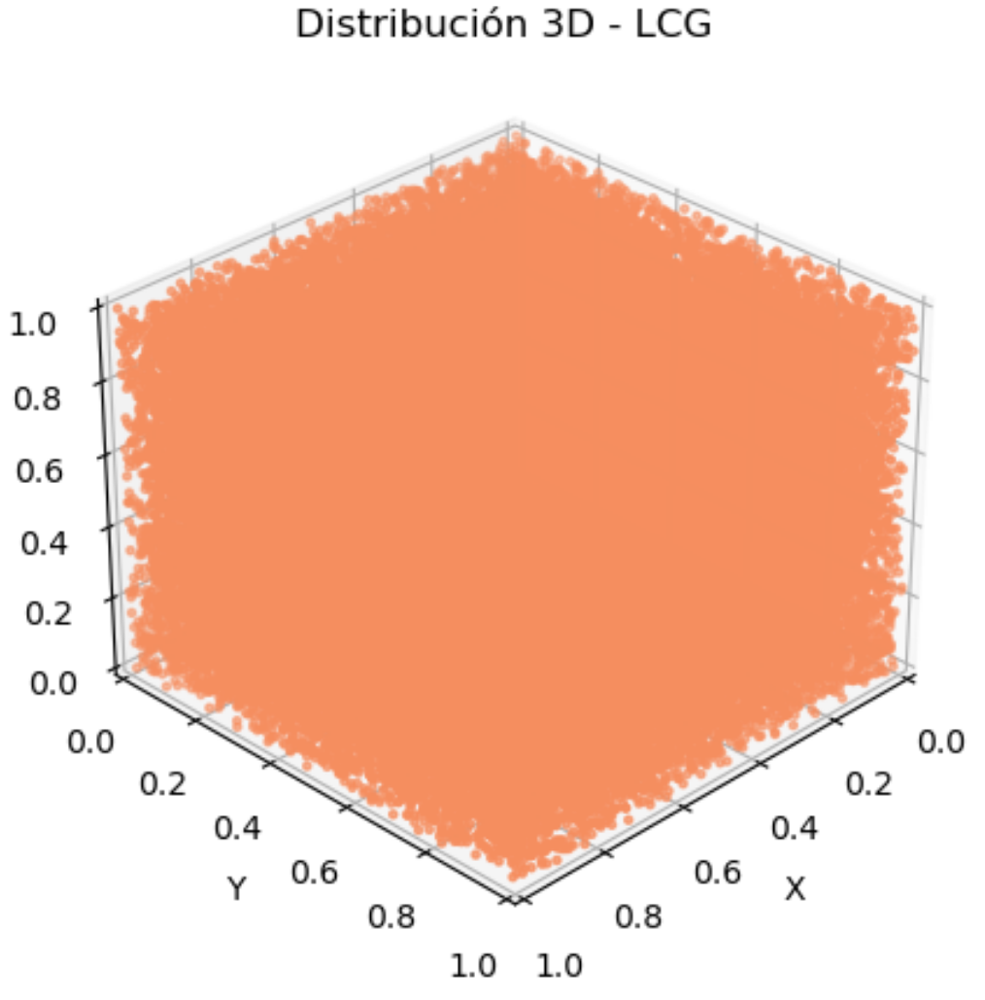
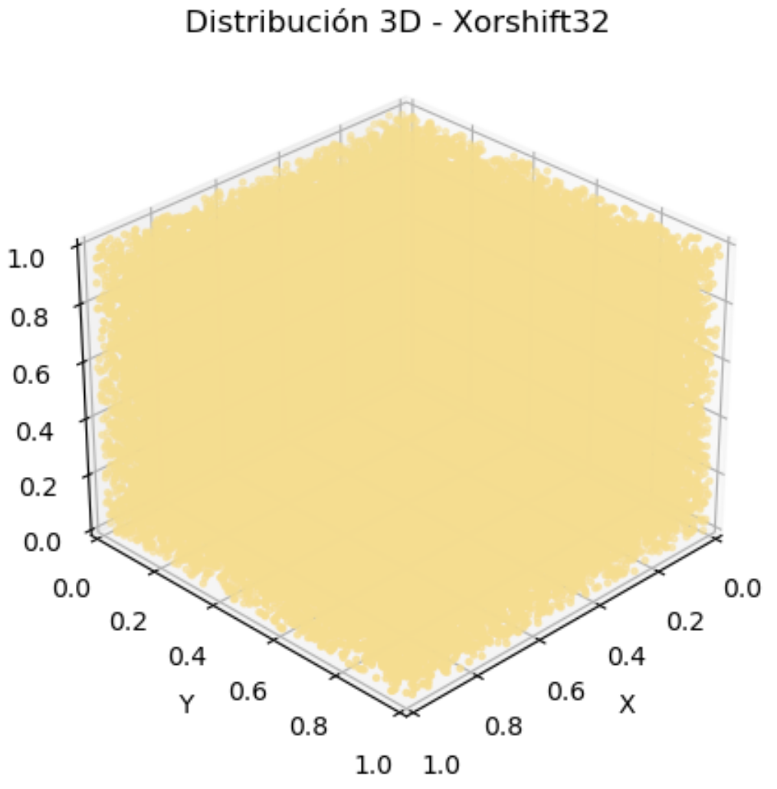
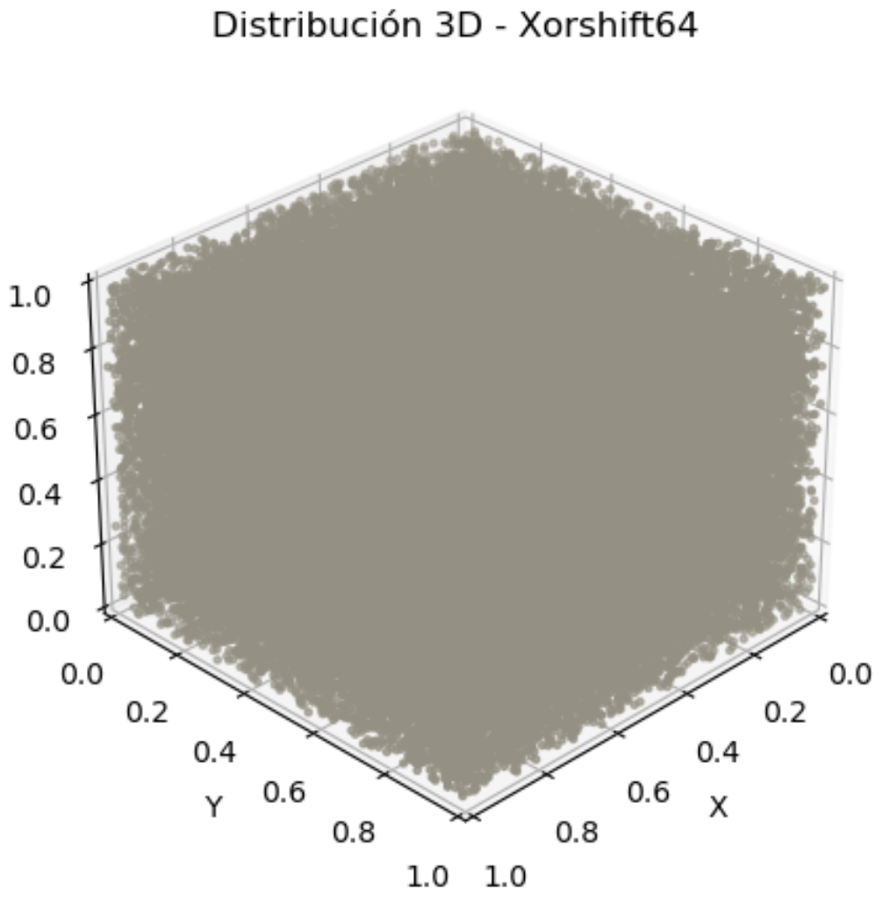
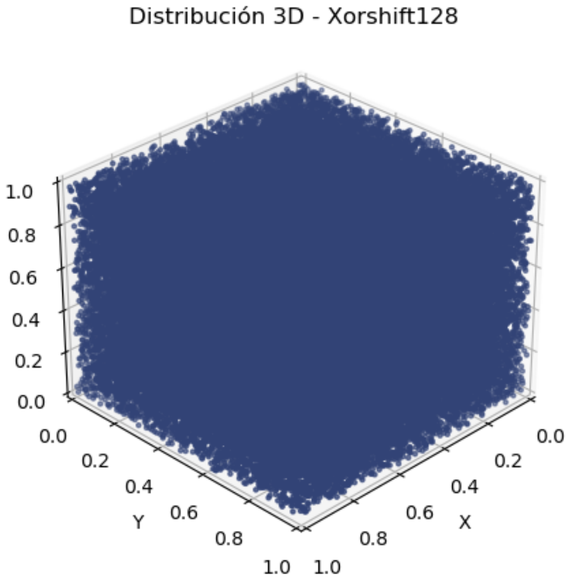
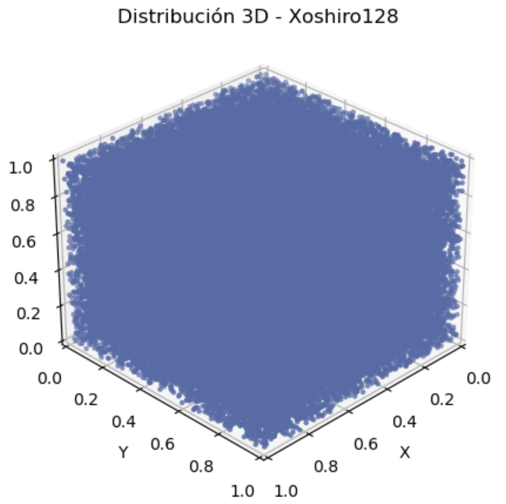
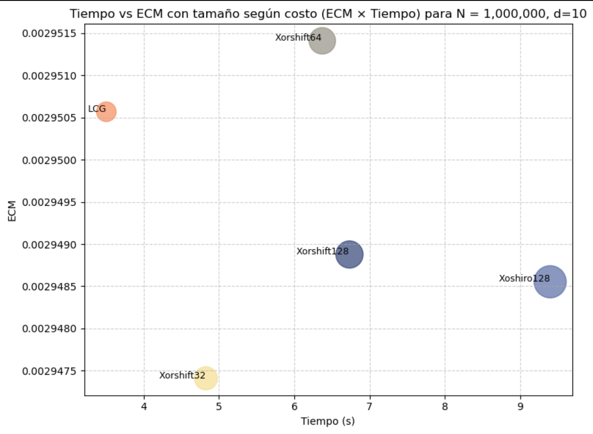

<h1 style="color: #DAA520;">Comparación de Generadores Pseudoaleatorios mediante el Método de Monte Carlo</h1>

  
<strong>Integrantes:</strong>

  <ul style="list-style-type: disc; margin-left: 30px;">
    <li>ARIAS, Eliana</li>
    <li>GUTIÉRREZ, Camilo</li>
  </ul>
  
<strong>Fecha de entrega:</strong> 15 de junio 2025

<h2 style="color: #DAA520;">Resumen</h2>

Este informe analiza y compara el desempeño de distintos generadores de números pseudoaleatorios aplicados a la estimación de una integral definida mediante el método de Monte Carlo. Se utilizan generadores clásicos como <code>LCG</code> y variantes más modernas como <code>Xorshift</code> y <code>Xoshiro</code>. Se evalúan su eficiencia, precisión, estabilidad y varianza obtenida en las simulaciones.

<h2 style="color: #DAA520;">1. Descripción del problema de simulación</h2>

Se desea estimar la siguiente integral múltiple sobre el hipercubo \( [0,1]^d \):

\[
I_d = \int_{[0,1]^d} e^{-\sum x_i^2} \, dx
\]

Esta integral tiene una solución teórica conocida basada en el producto de funciones error:

\[
I_d = \left( \frac{\sqrt{\pi} \cdot \mathrm{erf}(1)}{2} \right)^d
\]

Se utiliza el método de Monte Carlo para estimar su valor con diferentes generadores y distintas combinaciones de dimensión y cantidad de muestras.

<h2 style="color: #DAA520;">2. Generadores estudiados</h2>

<h3 style="color: #DAA520;">2.1 LCG (Linear Congruential Generator)</h3>
<ul>
<li><strong>Fórmula:</strong></li>

$$
Y_{n+1} = (a \cdot Y_n) \bmod m
$$

<li><strong>Parámetros usados:</strong> a = 16807, m = 231 - 1</li>
<li><strong>Periodo:</strong> 231 - 2<a href="#nota1">[1]</a></li>
<li><strong>Ventajas:</strong> Implementación sencilla, muy rápido.</li>
<li><strong>Desventajas:</strong> Correlaciones a largo plazo, no adecuado para aplicaciones criptográficas.</li>
</ul>

<h3 style="color: #DAA520;">2.2 Xorshift (32, 64, 128 bits)</h3>

- Utiliza operaciones XOR y desplazamientos bit a bit<a href="#nota2">[2]</a>.
- **Xorshift32**  
  - **Fórmula:**
    $$
    y = y \oplus (y \ll a);\quad
    y = y \oplus (y \gg b);\quad
    y = y \oplus (y \ll c)
    $$  
  - **Parámetros usados:** a = 13, b = 17, c = 5
  - **Periodo:** 232 - 1</li>

- **Xorshift64**  
  - **Fórmula:**
    $$
    y = y \oplus (y \gg c);\quad 
    y = y \oplus (y \ll b);\quad 
    y = y \oplus (y \gg a)
    $$  
  - **Parámetros usados:** a = 1 b = 13, c = 45
  - **Periodo:** 264 - 1</li>

- **Xorshift128+**  
  - **Fórmula:**
    $$
    y = estado_0 + estado_1 \mod 2^{64}
    $$  
  - **Parámetros usados:** a = 23, b = 18, c = 5
  - **Periodo:** 2128 - 1</li>
<ul>
<li><strong>Ventajas:</strong> Muy rápido, buena distribución estadística.</li>
<li><strong>Desventajas:</strong> No es criptográficamente seguro.</li>
</ul>

<h3 style="color: #DAA520;">2.3 Xoshiro128++</h3>
<ul>
<li>Uno de los generadores modernos más robustos; sin embargo, estamos utilizando una de las versiones menos precisas de la familia xoshiro<a href="#nota3">[3]</a>.</li>

<li><strong>Fórmula:</strong></li>

$$
y = \text{rotl}(estado_0 + estado_3, r) + estado_0
$$  

<li><strong>Parámetros usados:</strong> a = 9, b = 11, r = 7</li>
<li><strong>Periodo:</strong> 2128 - 1</li>
<li><strong>Ventajas:</strong> Buena calidad, velocidad adecuada para simulaciones numéricas.</li>
<li><strong>Desventajas:</strong> Complejidad levemente mayor.</li>
</ul>

<ol style="font-size: 0.9em; margin-left: 2em;">
  <li id="nota1"> Por el Teorema 3.2. del apunte y por la verificación hecha en el <a href="#codigo">código adjunto</a>, podemos afirmar que el generador congruencial lineal tiene periódo máximo.</li>
  <li id="nota2"> Las fórmulas y parámetros de los generadores xorshift32 y xorshift64 fueron elegidas de entre todas las posbiles que garantizan un periódo máximo según <a href="#ref1">Marsaglia (2003)</a>. Para el caso del generador xorshift128, nos basamos en la implementación de <a href="#ref2">Vigna (2017)</a> que garantiza periodo máximo.</li>
  <li id="nota3"> Nos guiamos de la implementación propuesta por <a href="#ref3">Blackman & Vignia(2021)</a> que garantiza periodo máximo.</li>
</ol>

<h2 style="color: #DAA520;">3. Metodología</h2>

<ul>
<li><strong>Lenguaje usado:</strong> Python 3.12.3</li>
<li><strong>Librerías:</strong> mumpy, matplotlib, math, time, ctypes, tempfile, subprocess, os, sympy, random, ipywidgets, mpl_toolkits, IPython</li>
<li><strong>Muestras simuladas:</strong> N = 10⁴, 10⁵, 10⁶</li>
<li><strong>Dimensiones simuladas:</strong> d = 2, 5, 10</li>
<li><strong>Criterios de comparación:</strong> estimación de la integral, error absoluto, varianza de la muestra, error cuadrático medio de la muestra, tiempo de ejecución, distribución.</li>
<li><strong>Tests adicionales:</strong> Test de los hiperplanos y algún otro test de aleatoriedad(TODO).</li>
</ul>

<h2 style="color: #DAA520;">4. Resultados y Análisis</h2>

<h3 style="color: #DAA520;">4.1 Semilla</h3>

Para obtener una semilla de buena calidad estadística, hacemos uso de la instrucción <a href="#ref4">RDSEED</a> la cual, dependiendo de la versión, genera un número aleatorio de 32 o 64 bits a partir del hardware. Suele ser bastante lenta ya que, además de recolectar entropía, realiza tests de autoverificación internos y puede incluso llegar a fallar si no hay suficiente entropía.

Como Python no permite directamente el uso de intrinsics, tuvimos que insertar código en C para poder utilizar la instrucción. Tal implementación se encuentra en el <a href="#codigo">código adjunto</a>.

En lo que respecta a las simulaciones, utilizaremos las siguientes semillas obtenidas mediante la instrucción <code>RDSEED</code>:

<figure>
  <table cellspacing="0" cellpadding="6"
         style="text-align: left; margin-left: auto; margin-right: auto; border-collapse: collapse;">
    <thead>
      <tr>
        <th>Generador</th>
        <th>Semilla(s)</th>
      </tr>
    </thead>
    <tbody>
      <tr>
        <td><strong>CGL</strong></td>
        <td>4155788116</td>
      </tr>
      <tr>
        <td><strong>Xorshift32</strong></td>
        <td>3016030231</td>
      </tr>
      <tr>
        <td><strong>Xorshift64</strong></td>
        <td>17816317102425885533</td>
      </tr>
      <tr>
        <td><strong>Xorshift128+</strong></td>
        <td>8551759191851867145, 9037421324366481566</td>
      </tr>
      <tr>
        <td><strong>Xoshiro128++</strong></td>
        <td>608405726, 470204612, 4172113938, 3888846613</td>
      </tr>
    </tbody>
  </table>
</figure>

<h3 style="color: #DAA520;">4.2 Distribución Individual</h3>

Se generaron 10 millones de muestras para cada generador normalizado en el intervalo [0,1). También se utilizó como referencia el generador de números aleatorios en el intervalo [0,1) de la librería random de Python con una semilla fija de 42, el cual se implementa internamente con el algoritmo Mersenne Twister MT19937 y está ampliamente probado que tiene una alta calidad estadística.

Como se observa en los histogramas, para un N grande, la distribución se aproxima a una uniforme en el intervalo (0,1), lo cual es lo que esperaríamos de un buen generador.

<h3 style="color: #DAA520;">4.3 Distribución de a Pares</h3>

Se generaron 100 millones de pares del tipo (yi, yi+1) para cada generador normalizado en el intervalo [0,1). Se requirió un valor elevado de pares para poder observar patrones en regiones reducidas del cuadrado unitario.

  

  

  

De lo anterior, podemos ver como los generadores de menor periodo son más propensos a mostrar patrones, lo cual indica una aleatoriedad inferior que aquellos con periodo 2128 - 1 como <code>xorshift128+</code> o <code>xoshiro128++</code> que no presentan patrones observables incluso con regiones de largo 10-4.
Resulta interesante ver como los puntos generados por <code>xorshift32</code> están mejores distribuídos que aquellos generados por <code>xorshift64</code>; atribuímos este fenómeno al hecho de que ambos comparten fórmulas similares con la diferencia de que tienen distintos tamaños de estado, lo que implica que para números mayores a 232 no alcanza solamente con desplazamientos y operaciones xor para lograr una buena distribución. 

<h3 style="color: #DAA520;">4.4 Distribución en el Cubo Unitario</h3>

Se generaron 1 millón de triplas del tipo (yi, yi+1, yi+2) para cada generador normalizado en el intervalo [0,1). La motivación detrás de las gráficas era detectar algún patrón visible que puediera revelar sesgos o correlaciones no deseadas en la secuencia de números generados.

  
  
  
  

  

Por lo visto en las gráficas, todos los generadores logran estimar adecuadamente el volumen del cubo unitario. Además, existe la posibilidad de interactuar con estas visualizaciones en el <a href="#codigo">código</a> pudiendo modificar el punto de vista y la cantidad de puntos generados.

<h3 style="color: #DAA520;">4.5 Simulación</h3>

Resultados obtenidos de las simulaciones para distintas combinaciones de dimensión y cantidad de muestras:

<figure>
  <table>
    <thead>
      <tr>
        <th>Generador</th>
        <th>N</th>
        <th>Estimación</th>
        <th>Error</th>
        <th>Varianza</th>
        <th>ECM</th>
        <th>Tiempo</th>
      </tr>
    </thead>
    <tbody>
      <tr><td>LCG</td><td>10,000</td><td>0.557396</td><td>3.50e-04</td><td>4.68e-02</td><td>4.80e-06</td><td>0.03s</td></tr>
      <tr><td>LCG</td><td>100,000</td><td>0.557629</td><td>1.17e-04</td><td>4.66e-02</td><td>4.79e-07</td><td>0.12s</td></tr>
      <tr><td>LCG</td><td>1,000,000</td><td>0.557927</td><td>1.81e-04</td><td>4.67e-02</td><td>7.94e-08</td><td>1.16s</td></tr>
      <tr><td>Xorshift32</td><td>10,000</td><td>0.560950</td><td>3.20e-03</td><td>4.66e-02</td><td>1.49e-05</td><td>0.02s</td></tr>
      <tr><td>Xorshift32</td><td>100,000</td><td>0.557517</td><td>2.29e-04</td><td>4.67e-02</td><td>5.20e-07</td><td>0.16s</td></tr>
      <tr><td>Xorshift32</td><td>1,000,000</td><td>0.558074</td><td>3.27e-04</td><td>4.67e-02</td><td>1.54e-07</td><td>1.55s</td></tr>
      <tr><td>Xorshift64</td><td>10,000</td><td>0.562412</td><td>4.67e-03</td><td>4.66e-02</td><td>2.64e-05</td><td>0.02s</td></tr>
      <tr><td>Xorshift64</td><td>100,000</td><td>0.557761</td><td>1.49e-05</td><td>4.68e-02</td><td>4.68e-07</td><td>0.20s</td></tr>
      <tr><td>Xorshift64</td><td>1,000,000</td><td>0.557675</td><td>7.13e-05</td><td>4.67e-02</td><td>5.18e-08</td><td>2.05s</td></tr>
      <tr><td>Xorshift128</td><td>10,000</td><td>0.557103</td><td>6.43e-04</td><td>4.75e-02</td><td>5.16e-06</td><td>0.02s</td></tr>
      <tr><td>Xorshift128</td><td>100,000</td><td>0.558709</td><td>9.62e-04</td><td>4.66e-02</td><td>1.39e-06</td><td>0.21s</td></tr>
      <tr><td>Xorshift128</td><td>1,000,000</td><td>0.558150</td><td>4.04e-04</td><td>4.67e-02</td><td>2.10e-07</td><td>2.13s</td></tr>
      <tr><td>Xoshiro128</td><td>10,000</td><td>0.559855</td><td>2.11e-03</td><td>4.77e-02</td><td>9.22e-06</td><td>0.03s</td></tr>
      <tr><td>Xoshiro128</td><td>100,000</td><td>0.559100</td><td>1.35e-03</td><td>4.69e-02</td><td>2.30e-06</td><td>0.33s</td></tr>
      <tr><td>Xoshiro128</td><td>1,000,000</td><td>0.557454</td><td>2.92e-04</td><td>4.67e-02</td><td>1.32e-07</td><td>2.97s</td></tr>
    </tbody>
  </table>
  <figcaption>Resultados para d = 2</figcaption>
</figure>

<figure>
  <table>
    <thead>
      <tr>
        <th>Generador</th>
        <th>N</th>
        <th>Estimación</th>
        <th>Error</th>
        <th>Varianza</th>
        <th>ECM</th>
        <th>Tiempo</th>
      </tr>
    </thead>
    <tbody>
      <tr><td>LCG</td><td>10,000</td><td>0.230003</td><td>2.32e-03</td><td>2.19e-02</td><td>7.57e-06</td><td>0.03s</td></tr>
      <tr><td>LCG</td><td>100,000</td><td>0.231919</td><td>4.04e-04</td><td>2.24e-02</td><td>3.87e-07</td><td>0.25s</td></tr>
      <tr><td>LCG</td><td>1,000,000</td><td>0.232385</td><td>6.27e-05</td><td>2.26e-02</td><td>2.65e-08</td><td>2.76s</td></tr>
      <tr><td>Xorshift32</td><td>10,000</td><td>0.231253</td><td>1.07e-03</td><td>2.21e-02</td><td>3.36e-06</td><td>0.03s</td></tr>
      <tr><td>Xorshift32</td><td>100,000</td><td>0.232458</td><td>1.36e-04</td><td>2.25e-02</td><td>2.43e-07</td><td>0.34s</td></tr>
      <tr><td>Xorshift32</td><td>1,000,000</td><td>0.232196</td><td>1.27e-04</td><td>2.26e-02</td><td>3.87e-08</td><td>3.38s</td></tr>
      <tr><td>Xorshift64</td><td>10,000</td><td>0.230702</td><td>1.62e-03</td><td>2.22e-02</td><td>4.85e-06</td><td>0.05s</td></tr>
      <tr><td>Xorshift64</td><td>100,000</td><td>0.231745</td><td>5.78e-04</td><td>2.25e-02</td><td>5.59e-07</td><td>0.46s</td></tr>
      <tr><td>Xorshift64</td><td>1,000,000</td><td>0.232465</td><td>1.43e-04</td><td>2.26e-02</td><td>4.30e-08</td><td>4.45s</td></tr>
      <tr><td>Xorshift128</td><td>10,000</td><td>0.232701</td><td>3.78e-04</td><td>2.24e-02</td><td>2.39e-06</td><td>0.05s</td></tr>
      <tr><td>Xorshift128</td><td>100,000</td><td>0.232442</td><td>1.19e-04</td><td>2.25e-02</td><td>2.39e-07</td><td>0.55s</td></tr>
      <tr><td>Xorshift128</td><td>1,000,000</td><td>0.232196</td><td>1.27e-04</td><td>2.26e-02</td><td>3.87e-08</td><td>4.87s</td></tr>
      <tr><td>Xoshiro128</td><td>10,000</td><td>0.232263</td><td>5.96e-05</td><td>2.26e-02</td><td>2.27e-06</td><td>0.07s</td></tr>
      <tr><td>Xoshiro128</td><td>100,000</td><td>0.231895</td><td>4.27e-04</td><td>2.25e-02</td><td>4.08e-07</td><td>0.66s</td></tr>
      <tr><td>Xoshiro128</td><td>1,000,000</td><td>0.232328</td><td>5.41e-06</td><td>2.26e-02</td><td>2.26e-08</td><td>6.63s</td></tr>
    </tbody>
  </table>
  <figcaption>Resultados para d = 5</figcaption>
</figure>

<figure>
  <table>
    <thead>
      <tr>
        <th>Generador</th>
        <th>N</th>
        <th>Estimación</th>
        <th>Error</th>
        <th>Varianza</th>
        <th>ECM</th>
        <th>Tiempo</th>
      </tr>
    </thead>
    <tbody>
      <tr>
        <td>LCG</td>
        <td>10,000</td>
        <td>0.054575</td>
        <td>6.01e-04</td>
        <td>2.96e-03</td>
        <td>6.57e-07</td>
        <td>0.05s</td>
      </tr>
      <tr>
        <td>LCG</td>
        <td>100,000</td>
        <td>0.054014</td>
        <td>4.05e-05</td>
        <td>2.93e-03</td>
        <td>3.09e-08</td>
        <td>0.47s</td>
      </tr>
      <tr>
        <td>LCG</td>
        <td>1,000,000</td>
        <td>0.053958</td>
        <td>1.61e-05</td>
        <td>2.95e-03</td>
        <td>3.21e-09</td>
        <td>4.75s</td>
      </tr>
      <tr>
        <td>Xorshift32</td>
        <td>10,000</td>
        <td>0.054059</td>
        <td>8.49e-05</td>
        <td>3.02e-03</td>
        <td>3.10e-07</td>
        <td>0.07s</td>
      </tr>
      <tr>
        <td>Xorshift32</td>
        <td>100,000</td>
        <td>0.054109</td>
        <td>1.35e-04</td>
        <td>2.97e-03</td>
        <td>4.79e-08</td>
        <td>0.67s</td>
      </tr>
      <tr>
        <td>Xorshift32</td>
        <td>1,000,000</td>
        <td>0.054091</td>
        <td>1.17e-04</td>
        <td>2.96e-03</td>
        <td>1.67e-08</td>
        <td>6.57s</td>
      </tr>
      <tr>
        <td>Xorshift64</td>
        <td>10,000</td>
        <td>0.054309</td>
        <td>3.35e-04</td>
        <td>3.08e-03</td>
        <td>4.20e-07</td>
        <td>0.09s</td>
      </tr>
      <tr>
        <td>Xorshift64</td>
        <td>100,000</td>
        <td>0.053948</td>
        <td>2.62e-05</td>
        <td>2.93e-03</td>
        <td>3.00e-08</td>
        <td>0.88s</td>
      </tr>
      <tr>
        <td>Xorshift64</td>
        <td>1,000,000</td>
        <td>0.053902</td>
        <td>7.22e-05</td>
        <td>2.94e-03</td>
        <td>8.16e-09</td>
        <td>8.96s</td>
      </tr>
      <tr>
        <td>Xorshift128</td>
        <td>10,000</td>
        <td>0.053989</td>
        <td>1.54e-05</td>
        <td>2.88e-03</td>
        <td>2.88e-07</td>
        <td>0.09s</td>
      </tr>
      <tr>
        <td>Xorshift128</td>
        <td>100,000</td>
        <td>0.053876</td>
        <td>9.78e-05</td>
        <td>2.91e-03</td>
        <td>3.86e-08</td>
        <td>0.91s</td>
      </tr>
      <tr>
        <td>Xorshift128</td>
        <td>1,000,000</td>
        <td>0.053990</td>
        <td>1.61e-05</td>
        <td>2.94e-03</td>
        <td>3.20e-09</td>
        <td>9.35s</td>
      </tr>
      <tr>
        <td>Xoshiro128</td>
        <td>10,000</td>
        <td>0.054081</td>
        <td>1.07e-04</td>
        <td>2.83e-03</td>
        <td>2.95e-07</td>
        <td>0.13s</td>
      </tr>
      <tr>
        <td>Xoshiro128</td>
        <td>100,000</td>
        <td>0.053928</td>
        <td>4.59e-05</td>
        <td>2.94e-03</td>
        <td>3.16e-08</td>
        <td>1.26s</td>
      </tr>
      <tr>
        <td>Xoshiro128</td>
        <td>1,000,000</td>
        <td>0.053998</td>
        <td>2.45e-05</td>
        <td>2.95e-03</td>
        <td>3.55e-09</td>
        <td>13.06s</td>
      </tr>
    </tbody>
  </table>
  <figcaption>Resultados para d = 10</figcaption>
</figure>

<h3 style="color: #DAA520;">4.6. Costos</h3>

Definimos el <i>costo</i> de un generador en función del producto entre el Error Cuadrático Medio y el Tiempo de Simulación.

Tomando el caso de estudio más grande (N = 106, d = 10), realizamos la siguiente gráfica:

Mientras más a la izquierda se encuentre una burbuja, más rápido es su generador asociado; y mientras más abajo se encuentre, más preciso es su generador asociado. Por lo tanto, el punto óptimo se encuentra en la esquina inferior izquierda.

El tamaño de cada burbuja representa su costo, a mayor tamaño el generador asociado es más costoso. Por lo tanto, son preferibles las burbujas más pequeñas.

<h3 style="color: #DAA520;">4.7. Tests</h3>

<h2 style="color: #DAA520;">5. Conclusiones</h2>

 Del punto anterior, se concluye que: 

<ul>
  <li>Generalmente, a medida que la dimensión y el tamaño de la muestra aumentan, las estimaciones tienden a ser más precias, ya que el error disminuye, mientras que la varianza se mantiene relativamente estable. Esto sucede porque al generar una mayor cantidad de valores, se puede observar que las distribuciones de los generadores se aproximan mejor a una distribución uniforme, especialmente cuando el tamaño de la muestra es lo suficientemente grande.</li>
  <li>El periódo de un generador no influye tanto en la distribución, i.e. periodos grandes no garantizan alta aleatoriedad. Sin embargo, los generadores con los mayores periodos demuestran ser más efectivos para criptografía, ya que se hace computacionalmente inviable el poder detectar patrones.</li>
  <li>Para los 5 generadores estudiados, el análisis de costos nos dice que: si es más prioritaria la velocidad que la calidad estadística, el <code>generador congruencial lineal</code> es la mejor opción; si por otro lado, interesa más la calidad de los valores generados, siempre conviene utilizar <code>xorshift128+</code> antes que <code>xoshiro128++</code> ya que el primero puede llegar a conseguir la misma precisión o incluso una mejor que la del segundo y en mucho menos tiempo; y si necesitamos un generador más general <code>xorshift64</code> y sobre todo <code>xorshift32</code> son buenas opciones.</li>
</ul>

<h2 style="color: #DAA520;", id="codigo">6. Código fuente</h2>

El código completo de simulación y generación de gráficos se incluye en el archivo <code>simulacion.ipynb</code> adjunto.

<h2 style="color: #DAA520;">Bibliografía</h2>
<ol>
  <li id="ref1">
    Marsaglia, G. (2003). Xorshift RNGs. Journal of Statistical Software.
    <a href="https://www.jstatsoft.org/article/view/v008i14" target="_blank">[Link]</a>
  </li>
  <li id="ref2">
    Vigna, S. (2017). Further scramblings of Marsaglia’s xorshift generators. Journal of Computational and Applied Mathematics.
    <a href="https://doi.org/10.1016/j.cam.2016.11.006" target="_blank">[Link]</a>
<li id="ref3">
  Blackman, D., & Vigna, S. (2021). Scrambled Linear Pseudorandom Number Generators. 
  ACM Transactions on Mathematical Software. 
  <a href="https://doi.org/10.1145/3460772" target="_blank">[Link]</a>
</li>
<li id="ref4">
  Intel Corporation. Intel® Digital Random Number Generator (DRNG) Software Implementation Guide.
  <a href="https://www.intel.com/content/www/us/en/developer/articles/guide/intel-digital-random-number-generator-drng-software-implementation-guide.html" target="_blank">[Link]</a>
</li>
</ol>

