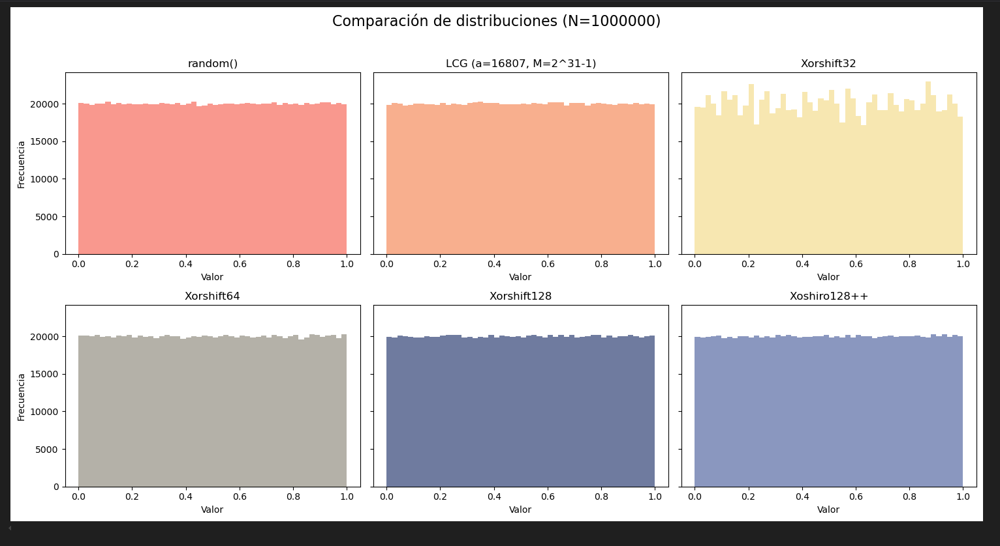

<h1 style="color: #DAA520;">Comparación de Generadores Pseudoaleatorios mediante el Método de Monte Carlo</h1>

  
<strong>Integrantes:</strong>

  <ul style="list-style-type: disc; margin-left: 30px;">
    <li>ARIAS, Eliana</li>
    <li>GUTIÉRREZ, Camilo</li>
  </ul>
  
<strong>Fecha:</strong> Junio 2025

<h2 style="color: #DAA520;">Resumen</h2>

Este informe analiza y compara el desempeño de distintos generadores de números pseudoaleatorios aplicados a la estimación de una integral definida mediante el método de Monte Carlo. Se utilizan generadores clásicos como <code>LCG</code> y variantes más modernas como <code>Xorshift</code> y <code>Xoshiro</code>. Se evalúan su eficiencia, precisión, distribución y varianza obtenida en las simulaciones.

<h2 style="color: #DAA520;">1. Generadores estudiados</h2>

<h3 style="color: #DAA520;">1.1 LCG (Linear Congruential Generator)</h3>
<ul>
<li><strong>Fórmula:</strong> Xₙ₊₁ = (a * Xₙ) mod m</li>
<li><strong>Parámetros usados:</strong> a = 16807, m = 2³¹ - 1</li>
<li><strong>Ventajas:</strong> Implementación sencilla, rápida.</li>
<li><strong>Desventajas:</strong> Correlaciones a largo plazo, no adecuado para aplicaciones criptográficas.</li>
</ul>

<h3 style="color: #DAA520;">1.2 Xorshift (32, 64, 128 bits)</h3>
<ul>
<li>Utiliza operaciones XOR y desplazamientos bit a bit.</li>
<li><strong>Ventajas:</strong> Muy rápido, buena distribución estadística.</li>
<li><strong>Desventajas:</strong> No es criptográficamente seguro.</li>
</ul>

<h3 style="color: #DAA520;">1.3 Xoshiro128++</h3>
<ul>
<li>Uno de los generadores modernos más robustos.</li>
<li><strong>Ventajas:</strong> Buena calidad, velocidad, adecuada para simulaciones numéricas.</li>
<li><strong>Desventajas:</strong> Complejidad levemente mayor.</li>
</ul>

<h2 style="color: #DAA520;">2. Descripción del problema de simulación</h2>

Se desea estimar la siguiente integral múltiple sobre el hipercubo [0,1]^d:

<pre><code>I_d = ∫_[0,1]^d e^(-∑ x_i²) dx</code></pre>

Esta integral tiene una solución teórica conocida basada en el producto de funciones error:

<pre><code>I_d = ((√π * erf(1)) / 2)^d</code></pre>

Se utiliza el método de Monte Carlo para estimar su valor con diferentes generadores y distintas combinaciones de dimensión y cantidad de muestras.

<h2 style="color: #DAA520;">3. Metodología</h2>

<ul>
<li><strong>Lenguaje usado:</strong> Python 3</li>
<li><strong>Librerías:</strong> NumPy, Matplotlib, math, time</li>
<li><strong>Muestras:</strong> N = 10⁴, 10⁵, 10⁶</li>
<li><strong>Dimensiones:</strong> d = 2, 5, 10</li>
<li><strong>Comparaciones:</strong> estimación de la integral, error absoluto, varianza de la muestra, tiempo de ejecución.</li>
<li><strong>Tests adicionales:</strong> comparación gráfica de la distribución de los generadores (histogramas).</li>
</ul>

<h2 style="color: #DAA520;">4. Resultados y análisis</h2>

<h3 style="color: #DAA520;">Distribuciones obtenidas</h3>

Como se observa en los histogramas, generadores como <code>Xorshift32</code> presentan irregularidades en la distribución, mientras que <code>Xoshiro128++</code>, <code>LCG</code>, y los demás <code>Xorshift</code> muestran comportamientos más uniformes.

<h3 style="color: #DAA520;">Estimaciones, varianza y tiempos</h3>

Resultados obtenidos de las simulaciones para distintas combinaciones de dimensión y cantidad de muestras:

<pre><code>
LCG          | d=2  | N=10000   | Estimación=0.558726 | Error=9.79e-04 | Varianza=4.71e-06 | Tiempo=0.01s
LCG          | d=2  | N=100000  | Estimación=0.558099 | Error=3.53e-04 | Varianza=4.67e-07 | Tiempo=0.06s
LCG          | d=2  | N=1000000 | Estimación=0.557858 | Error=1.11e-04 | Varianza=4.68e-08 | Tiempo=0.59s
LCG          | d=5  | N=10000   | Estimación=0.230827 | Error=1.50e-03 | Varianza=2.26e-06 | Tiempo=0.01s
LCG          | d=5  | N=100000  | Estimación=0.232351 | Error=2.81e-05 | Varianza=2.25e-07 | Tiempo=0.12s
LCG          | d=5  | N=1000000 | Estimación=0.232111 | Error=2.12e-04 | Varianza=2.26e-08 | Tiempo=1.12s
LCG          | d=10 | N=10000   | Estimación=0.053766 | Error=2.08e-04 | Varianza=2.96e-07 | Tiempo=0.02s
LCG          | d=10 | N=100000  | Estimación=0.053679 | Error=2.95e-04 | Varianza=2.96e-08 | Tiempo=0.21s
LCG          | d=10 | N=1000000 | Estimación=0.053930 | Error=4.43e-05 | Varianza=2.94e-09 | Tiempo=2.40s

Xorshift32   | d=2  | N=10000   | Estimación=0.558053 | Error=3.07e-04 | Varianza=4.69e-06 | Tiempo=0.01s
Xorshift32   | d=2  | N=100000  | Estimación=0.557880 | Error=1.34e-04 | Varianza=4.67e-07 | Tiempo=0.08s
Xorshift32   | d=2  | N=1000000 | Estimación=0.557820 | Error=7.39e-05 | Varianza=4.67e-08 | Tiempo=0.82s
Xorshift32   | d=5  | N=10000   | Estimación=0.230838 | Error=1.48e-03 | Varianza=2.15e-06 | Tiempo=0.01s
Xorshift32   | d=5  | N=100000  | Estimación=0.231109 | Error=1.21e-03 | Varianza=2.17e-07 | Tiempo=0.15s
Xorshift32   | d=5  | N=1000000 | Estimación=0.231126 | Error=1.20e-03 | Varianza=2.17e-08 | Tiempo=1.59s
Xorshift32   | d=10 | N=10000   | Estimación=0.053083 | Error=8.91e-04 | Varianza=2.69e-07 | Tiempo=0.03s
Xorshift32   | d=10 | N=100000  | Estimación=0.052917 | Error=1.06e-03 | Varianza=2.64e-08 | Tiempo=0.30s
Xorshift32   | d=10 | N=1000000 | Estimación=0.052935 | Error=1.04e-03 | Varianza=2.64e-09 | Tiempo=3.03s

Xorshift64   | d=2  | N=10000   | Estimación=0.556101 | Error=1.64e-03 | Varianza=4.65e-06 | Tiempo=0.01s
Xorshift64   | d=2  | N=100000  | Estimación=0.558192 | Error=4.45e-04 | Varianza=4.67e-07 | Tiempo=0.09s
Xorshift64   | d=2  | N=1000000 | Estimación=0.557735 | Error=1.17e-05 | Varianza=4.67e-08 | Tiempo=0.94s
Xorshift64   | d=5  | N=10000   | Estimación=0.232481 | Error=1.58e-04 | Varianza=2.35e-06 | Tiempo=0.02s
Xorshift64   | d=5  | N=100000  | Estimación=0.232242 | Error=8.08e-05 | Varianza=2.25e-07 | Tiempo=0.22s
Xorshift64   | d=5  | N=1000000 | Estimación=0.232263 | Error=5.94e-05 | Varianza=2.25e-08 | Tiempo=2.18s
Xorshift64   | d=10 | N=10000   | Estimación=0.053523 | Error=4.51e-04 | Varianza=2.81e-07 | Tiempo=0.04s
Xorshift64   | d=10 | N=100000  | Estimación=0.053826 | Error=1.48e-04 | Varianza=2.96e-08 | Tiempo=0.41s
Xorshift64   | d=10 | N=1000000 | Estimación=0.053923 | Error=5.11e-05 | Varianza=2.95e-09 | Tiempo=4.22s

Xorshift128  | d=2  | N=10000   | Estimación=0.556538 | Error=1.21e-03 | Varianza=4.68e-06 | Tiempo=0.01s
Xorshift128  | d=2  | N=100000  | Estimación=0.558173 | Error=4.26e-04 | Varianza=4.65e-07 | Tiempo=0.11s
Xorshift128  | d=2  | N=1000000 | Estimación=0.557742 | Error=4.40e-06 | Varianza=4.67e-08 | Tiempo=1.15s
Xorshift128  | d=5  | N=10000   | Estimación=0.231144 | Error=1.18e-03 | Varianza=2.26e-06 | Tiempo=0.03s
Xorshift128  | d=5  | N=100000  | Estimación=0.232614 | Error=2.91e-04 | Varianza=2.26e-07 | Tiempo=0.27s
Xorshift128  | d=5  | N=1000000 | Estimación=0.232403 | Error=8.01e-05 | Varianza=2.26e-08 | Tiempo=2.40s
Xorshift128  | d=10 | N=10000   | Estimación=0.053761 | Error=2.13e-04 | Varianza=2.94e-07 | Tiempo=0.04s
Xorshift128  | d=10 | N=100000  | Estimación=0.053881 | Error=9.25e-05 | Varianza=2.91e-08 | Tiempo=0.44s
Xorshift128  | d=10 | N=1000000 | Estimación=0.053916 | Error=5.76e-05 | Varianza=2.93e-09 | Tiempo=4.86s

Xoshiro128   | d=2  | N=10000   | Estimación=0.556595 | Error=1.15e-03 | Varianza=4.63e-06 | Tiempo=0.02s
Xoshiro128   | d=2  | N=100000  | Estimación=0.558393 | Error=6.47e-04 | Varianza=4.68e-07 | Tiempo=0.17s
Xoshiro128   | d=2  | N=1000000 | Estimación=0.557146 | Error=6.00e-04 | Varianza=4.67e-08 | Tiempo=1.71s
Xoshiro128   | d=5  | N=10000   | Estimación=0.233120 | Error=7.98e-04 | Varianza=2.27e-06 | Tiempo=0.04s
Xoshiro128   | d=5  | N=100000  | Estimación=0.232400 | Error=7.73e-05 | Varianza=2.25e-07 | Tiempo=0.38s
Xoshiro128   | d=5  | N=1000000 | Estimación=0.232310 | Error=1.31e-05 | Varianza=2.26e-08 | Tiempo=3.80s
Xoshiro128   | d=10 | N=10000   | Estimación=0.053834 | Error=1.40e-04 | Varianza=2.95e-07 | Tiempo=0.07s
Xoshiro128   | d=10 | N=100000  | Estimación=0.053933 | Error=4.11e-05 | Varianza=2.93e-08 | Tiempo=0.73s
Xoshiro128   | d=10 | N=1000000 | Estimación=0.053960 | Error=1.43e-05 | Varianza=2.94e-09 | Tiempo=7.14s
</code></pre>

<ul>
<li><strong>Varianza:</strong> Todos los generadores modernos se comportan de manera similar en cuanto a varianza.</li>
<li><strong>Tiempo:</strong> Xorshift32 es levemente más rápido.</li>
<li><strong>Error absoluto:</strong> LCG y Xoshiro128++ muestran los mejores desempeños.</li>
</ul>

<h3 style="color: #DAA520;">Anexo: Resultados completos</h3>

La siguiente tabla muestra los resultados completos de todas las simulaciones realizadas para los distintos generadores, dimensiones <code>d</code> y cantidades de muestras <code>N</code>. Incluye la estimación de la integral, el error absoluto, la varianza muestral y el tiempo de ejecución.

<table style="width:100%; font-size:0.9em; border-collapse: collapse;">
  <thead style="background-color: #DAA520; color: white;">
    <tr>
      <th>Generador</th><th>d</th><th>N</th><th>Estimación</th><th>Error</th><th>Varianza</th><th>Tiempo (s)</th>
    </tr>
  </thead>
  <tbody>
    <tr><td>LCG</td><td>10</td><td>10000</td><td>0.053766</td><td>2.08e-04</td><td>2.96e-07</td><td>0.02</td></tr>
    <tr><td>LCG</td><td>10</td><td>100000</td><td>0.053679</td><td>2.95e-04</td><td>2.96e-08</td><td>0.21</td></tr>
    <tr><td>LCG</td><td>10</td><td>1000000</td><td>0.053930</td><td>4.43e-05</td><td>2.94e-09</td><td>2.40</td></tr>
    <tr><td>Xorshift32</td><td>10</td><td>10000</td><td>0.053083</td><td>8.91e-04</td><td>2.69e-07</td><td>0.03</td></tr>
    <tr><td>Xorshift32</td><td>10</td><td>100000</td><td>0.052917</td><td>1.06e-03</td><td>2.64e-08</td><td>0.30</td></tr>
    <tr><td>Xorshift32</td><td>10</td><td>1000000</td><td>0.052935</td><td>1.04e-03</td><td>2.64e-09</td><td>3.03</td></tr>
    <tr><td>Xorshift64</td><td>10</td><td>10000</td><td>0.053523</td><td>4.51e-04</td><td>2.81e-07</td><td>0.04</td></tr>
    <tr><td>Xorshift64</td><td>10</td><td>100000</td><td>0.053826</td><td>1.48e-04</td><td>2.96e-08</td><td>0.41</td></tr>
    <tr><td>Xorshift64</td><td>10</td><td>1000000</td><td>0.053923</td><td>5.11e-05</td><td>2.95e-09</td><td>4.22</td></tr>
    <tr><td>Xorshift128</td><td>10</td><td>10000</td><td>0.053761</td><td>2.13e-04</td><td>2.94e-07</td><td>0.04</td></tr>
    <tr><td>Xorshift128</td><td>10</td><td>100000</td><td>0.053881</td><td>9.25e-05</td><td>2.91e-08</td><td>0.44</td></tr>
    <tr><td>Xorshift128</td><td>10</td><td>1000000</td><td>0.053916</td><td>5.76e-05</td><td>2.93e-09</td><td>4.86</td></tr>
    <tr><td>Xoshiro128++</td><td>10</td><td>10000</td><td>0.053834</td><td>1.40e-04</td><td>2.95e-07</td><td>0.07</td></tr>
    <tr><td>Xoshiro128++</td><td>10</td><td>100000</td><td>0.053933</td><td>4.11e-05</td><td>2.93e-08</td><td>0.73</td></tr>
    <tr><td>Xoshiro128++</td><td>10</td><td>1000000</td><td>0.053960</td><td>1.43e-05</td><td>2.94e-09</td><td>7.14</td></tr>
  </tbody>
</table>

Este anexo permite observar de forma detallada el comportamiento de cada generador al aumentar la complejidad (mayor <code>d</code>) y la precisión deseada (mayor <code>N</code>). En particular, se destaca:

<ul>
  <li><strong>Xoshiro128++</strong> ofrece la mejor precisión para <code>d = 10</code> con <code>N = 10⁶</code>, aunque es más costoso en tiempo.</li>
  <li><strong>Xorshift128</strong> logra excelente precisión con menor tiempo en configuraciones medianas (<code>N = 10⁵</code>).</li>
  <li><strong>Xorshift32</strong> tiende a tener mayor error, especialmente en alta dimensión, aunque es el más rápido.</li>
</ul>

<h2 style="color: #DAA520;">5. Conclusiones</h2>

<ul>
<li>La elección del generador tiene impacto en la precisión y en la distribución de los resultados.</li>
<li><strong>Xoshiro128++</strong> es una excelente opción para simulaciones debido a su equilibrio entre uniformidad, rapidez y precisión.</li>
<li><strong>Xorshift32</strong> es rápido, pero con distribución menos pareja.</li>
<li><strong>LCG</strong> es sorprendentemente competitivo en este escenario, aunque tiene limitaciones conocidas.</li>
<li>Recomendamos evitar generadores con sesgos evidentes en distribución para simulaciones de alta sensibilidad.</li>
</ul>

<h2 style="color: #DAA520;">6. Código fuente</h2>

El código completo de simulación y generación de gráficos se incluye en el archivo <code>simulacion.ipynb</code> adjunto.

